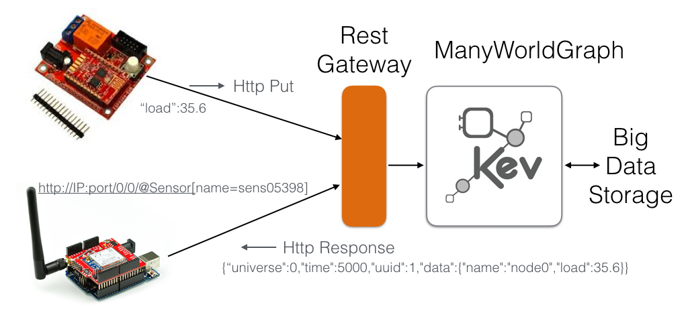

# Many World Graph Plugin: Rest Gateway

### Introduction


This plugin, designed for any KMF offers a generic way to interact with model (read/write) using a classic but efficient **REST API**.
This addon is implemented as a server that can be embedded in any Java project (JS version to come in NodeJS soon).

The goal of such Rest Server is to offers a **standard way to interact with model** for devices that cann't run for technical reasons KMF API.
For instance, **Arduino** or **ESP 8266** based devices (AVR processor) can't for memory reason load the fll KMF stack.
However, they are powerful enough to load an HTTP stack and theirfore they can through such connection push data to a model.
Such usage make particular sense because Arduino like devices host usually sensors, they should be considered as edges in IoT networks.

The following picture give a short overview about the target architecture.
In a nutshell, HTTP Path are mapped to KMF Queries to retreive or select KMF Objects, and the payload follows the JSON format for get and put operations.



In particular this REST offers the ability to manipulated model according to time and universes of KMF.
It interesting to notice that every REST HTTP get and put request start by two long attribute `/0/10` the first one is the universe ID (virtually a working space) the second is simply a timestamp to reflect the time of the measurement. The KMF semamtic will return the closest well know time in case of GET and will update the current time for the 

## Last versions:

- 1.0 compatible with mwg API 1.x

## Changelog

- 1.0 use Undertow in version 1.3.22.Final

### Compilation

No particular dependency to compile, tested on Java 8.

```xml
mvn clean install
```

### Usage

Simply add the plugin to your Maven project.

```xml
        <dependency>
            <groupId>org.kevoree.mwg.plugins</groupId>
            <artifactId>rest</artifactId>
            <version>REPLACE_BY_LAST_VERSION</version>
        </dependency>
```

Then in you main or any kind of place of your Java platform, wrap the model into a Rest Gateway server and start it.

```java
int httpPort = 8050;
RestGateway gateway = RestGateway.expose(graph, httpPort);
gateway.start();
```

Replace the 8050 by the expected port where you want to expose your HTTP server.

When your application is stopped, don't forget to stop as well the server using:

```java
gateway.stop();
```

### Reference Rest API

The REST API allows two kind of operations: GET and PUT
Both share the same **PATH** schema as the following:

```
/<QUERY_1>/<QUERY_2>... /<QUERY_N>?world=<WORLD_ID>&time=<TIME>
```

In short, the PATH allows to select a set of mwg nodes.
QUERY are FILTERS which are assembled such as PIPE in UNIX system and each filter follow the TASK api of mwg.
Therefore, query parameters describe the reference WORLD AND TIME that should be use to traverse the KMF Model.

In all following examples we will consider the following very simple graph to illustrate snippets.

```java
Graph graph = GraphBuilder.builder().withScheduler(new NoopScheduler()).build();
graph.connect(o -> {
    for (int i = 0; i < 10; i++) {
        //Create a node named nodeX
        Node nodeLoop = graph.newNode(0, i);
        nodeLoop.set("name", "node" + i);
        nodeLoop.set("load", i);
        //Attach a subNode process
        Node subProcessLoop = graph.newNode(0, i);
        subProcessLoop.set("name", "process" + i);
        subProcessLoop.set("load", i);
        nodeLoop.add("processes", subProcessLoop);
        //Index the node in the index names using his attribute name
        graph.index("nodes", nodeLoop, "name", null);
    }
    RestGateway gateway = RestGateway.expose(graph, 8050);
    gateway.start();
}
```

##### GET OPERATIONS

The **HTTP GET** operation allows to retrieve a JSON array composed by selected objects.
Therefore the following

```http
http://localhost:8050/fromIndexAll(nodes)?time=10
```

results would be:

```json
[
{"world":0,"data":{"processes":[2],"load":0,"name":"node0"},"time":10,"id":1},
{"world":0,"data":{"processes":[5],"load":1,"name":"node1"},"time":10,"id":4},
{"world":0,"data":{"processes":[7],"load":2,"name":"node2"},"time":10,"id":6},
{"world":0,"data":{"processes":[9],"load":3,"name":"node3"},"time":10,"id":8},
{"world":0,"data":{"processes":[11],"load":4,"name":"node4"},"time":10,"id":10},
{"world":0,"data":{"processes":[13],"load":5,"name":"node5"},"time":10,"id":12},
{"world":0,"data":{"processes":[15],"load":6,"name":"node6"},"time":10,"id":14},
{"world":0,"data":{"processes":[17],"load":7,"name":"node7"},"time":10,"id":16},
{"world":0,"data":{"processes":[19],"load":8,"name":"node8"},"time":10,"id":18},
{"world":0,"data":{"processes":[21],"load":9,"name":"node9"},"time":10,"id":20}
]
```

However, the following line will select one particular object:

```
http://localhost:8050/fromIndexAll(nodes)/with(name,node1)?time=10
```

will return: 

```json
[
{"world":0,"data":{"processes":[5],"load":1,"name":"node1"},"time":10,"id":4}
]
```

on Unix machine this can be test using the `curl` command such as:

```sh
curl "http://localhost:8050/fromIndexAll(nodes)/with(name,node1)?time=10"
```

remember that URL should be encoded for special characters

##### PIPED FILTERS

As KMF Query, FILTERS can be piped il order to filter result from the server side.
For instance the following query:

```sh
curl http://localhost:8050/fromIndexAll(nodes)/traverse(processes)/with(name,process9)?time=10
```

Will collect sub processes of of all nodes and select the process named process9.
Please read the mwg KTask section in order to have all potential task actions.

##### POST OPERATIONS

The HTTP post operation can be leverage to put data into the graph.
Similarly to GET operation, the PATH select nodes that will be modified, and the POST payload, describe as key/values.
This set of ket/values will be injected on all selected objects.
This can be executed through the next command:

```sh
curl --data "load=42" "http://localhost:8050/fromIndexAll(nodes)/with(name,node1)?time=10"
```

Now the following command:

```json
curl "http://localhost:8050/fromIndexAll(nodes)/with(name,node1)?time=10"
```

Will reply:

```json
[
{"world":0,"data":{"processes":[5],"load":"42","name":"node1"},"time":10,"id":4}
]
```

### Dependencies

This plugin leverage the great Undertow library in order to implement the HTTP server.
